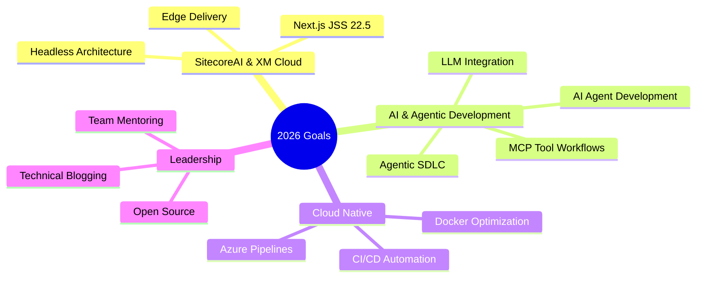

<div align="center">
  
  

  [](https://codewithsaket.com)
  [](https://blogs.perficient.com/author/saketsingh)
  [](https://www.linkedin.com/in/saketpsingh/)
  [](https://twitter.com/Saketsingh14942)
  
  
  
  
</div>

---

## About Me

```typescript
const saket: TechLead = {
  location: "Nagpur, Maharashtra, India",
  role: "Senior Technical Consultant (Technical Lead)",
  company: "Perficient",
  experience: "10+ years",
  expertise: [
    "SitecoreAI (XM Cloud)", "Sitecore SXA", "Headless CMS",
    "AI Agent Development", "LLM Integration", "MCP Tools",
    ".NET Core", "Next.js", "TypeScript"
  ],
  currentFocus: "AI-powered content automation & Agentic SDLC",
  achievements: {
    projectsDelivered: "5+ enterprise projects",
    clientSatisfaction: "98%",
    developersTrainied: "20+",
    teamProductivityBoost: "25%"
  }
};
```


- Technical Lead with **10+ years** building enterprise platforms
- Architect of **AI agents** with LLM & MCP tool integrations
- Led teams of **5 developers**, trained **20+ engineers**
- Delivered **5+ projects** with **98% client satisfaction**
- Introduced **AI-assisted development** workflows across teams
- Ask me about **Sitecore, AI Agents, .NET, Headless CMS**

<br clear="right"/>

---

## Tech Stack

<table align="center">
  <tr>
    <td align="center" width="140" height="112">
      
      <br><strong>.NET</strong>
    </td>
    <td align="center" width="140" height="112">
      
      <br><strong>C#</strong>
    </td>
    <td align="center" width="140" height="112">
      
      <br><strong>React</strong>
    </td>
    <td align="center" width="140" height="112">
      
      <br><strong>Next.js</strong>
    </td>
    <td align="center" width="140" height="112">
      
      <br><strong>TypeScript</strong>
    </td>
  </tr>
  <tr>
    <td align="center" width="140" height="112">
      
      <br><strong>JavaScript</strong>
    </td>
    <td align="center" width="140" height="112">
      
      <br><strong>Node.js</strong>
    </td>
    <td align="center" width="140" height="112">
      
      <br><strong>GraphQL</strong>
    </td>
    <td align="center" width="140" height="112">
      
      <br><strong>MSSQL</strong>
    </td>
    <td align="center" width="140" height="112">
      
      <br><strong>Docker</strong>
    </td>
  </tr>
  <tr>
    <td align="center" width="140" height="112">
      
      <br><strong>Azure</strong>
    </td>
    <td align="center" width="140" height="112">
      
      <br><strong>Git</strong>
    </td>
    <td align="center" width="140" height="112">
      
      <br><strong>GitHub</strong>
    </td>
    <td align="center" width="140" height="112">
      
      <br><strong>Jira</strong>
    </td>
    <td align="center" width="140" height="112">
      
      <br><strong>VS Code</strong>
    </td>
  </tr>
</table>

<div align="center">
  
  
  
  
  
  
  
</div>

---

## Certifications

<div align="center">

| Badge | Certification | Issuer |
|:-----:|---------------|--------|
|  | SitecoreAI CMS for Developers: Operations Fundamentals Knowledge Badge | Sitecore |
|  | SitecoreAI CMS for Developers: Deployment Basics Knowledge Badge | Sitecore |
|  | SitecoreAI CMS for Developers: Basics Knowledge Badge | Sitecore |
|  | L2 Agentic SDLC and STLC | Perficient |
|  | Career Essentials in GitHub Professional Certificate | LinkedIn |

</div>

---

## GitHub Analytics

<div align="center">
  
  
</div>

<div align="center">
  
</div>

---

## Featured Projects

<div align="center">
  <a href="https://github.com/saketpsingh/sitecoreai-content-agent">
    
  </a>
</div>

<div align="center">
  <table>
    <tr>
      <td align="center" width="100%">
        <h3>AI-Powered Content Transfer Agent</h3>
        <p>Architected an AI agent for automated Sitecore content migration with dependency analysis, circular-reference detection, topological sorting, schema validation, persistent memory, human-in-the-loop approval gates, and failure recovery workflows.</p>
        <p>
          
          
          
          
          
          
        </p>
      </td>
    </tr>
  </table>
</div>

### Other Notable Projects

| Project | Tech Stack | Highlights |
|---------|------------|------------|
| **Healthcare & Insurance Platform** | SitecoreAI, Next.js, JSS 22.5, Docker, Azure | Headless CMS with compliance-focused UI, Azure Pipelines CI/CD |
| **Manufacturing Platform** | SitecoreAI (XM Cloud), C#, Next.js | Reusable component library for global manufacturing client |
| **Healthcare & Banking** | Sitecore SXA, Solr, Unicorn | High-performance multi-site platform, led offshore team |

---

## Latest Blog Posts

<details open>
<summary><b>Sitecore Articles</b></summary>

| Date | Article | Link |
|------|---------|------|
| Feb 2024 | **Extending General Link for Content Editor** | [Read](https://blogs.perficient.com/2024/02/07/extending-general-link-for-content-editor-mode/) |
| Feb 2024 | **Extending General Link for Experience Editor** | [Read](https://blogs.perficient.com/2024/02/07/extending-general-link-for-experience-editor-mode/) |
| Feb 2024 | **Alternate Approach for Experience Editor Extension** | [Read](https://blogs.perficient.com/2024/02/21/extending-general-link-for-experience-editor-alternate-approach/) |
| May 2024 | **Handling Not Allowed Reflection Method** | [Read](https://blogs.perficient.com/2024/05/09/handling-not-allowed-reflection-method-in-sitecore/) |

</details>

<details>
<summary><b>Docker & Containers</b></summary>

| Date | Article | Link |
|------|---------|------|
| Apr 2023 | **Troubleshooting Docker Container Problems** | [Read](https://blogs.perficient.com/2023/04/25/troubleshooting-docker-container-problems/) |
| Apr 2023 | **Troubleshooting Docker Container Problems Part 2** | [Read](https://blogs.perficient.com/2023/04/25/troubleshooting-docker-container-problems-part-2/) |
| Jul 2023 | **Migrating Docker Compose V1 to V2** | [Read](https://blogs.perficient.com/2023/07/03/migrating-docker-compose-from-v1-to-v2-code-details/) |
| Nov 2023 | **Troubleshooting Sitecore Image Update Issue** | [Read](https://blogs.perficient.com/2023/11/15/troubleshooting-sitecore-image-update-issue/) |
| Dec 2023 | **Add Configuration for Non-Docker Desktop** | [Read](https://blogs.perficient.com/2023/12/27/add-configuration-for-non-docker-desktop/) |

</details>

<div align="center">
  <a href="https://codewithsaket.com/blogs">
    
  </a>
</div>

---

## Current Focus



---

## Achievements

<div align="center">

| Award | Description |
|-------|-------------|
| **Quarterly Excellence Awards** | Multiple awards at Perficient for consistent delivery |
| **Employee of the Month** | Recognized at Mastersoft ERP |
| **98% Client Satisfaction** | Across 5+ enterprise project deliveries |
| **Zero Critical Post-Launch Bugs** | Maintained across all delivered projects |

</div>

---

## Let's Connect

<div align="center">
  
  [](mailto:codingwithsaket@gmail.com)
  [](https://www.linkedin.com/in/saketpsingh/)
  [](https://twitter.com/Saketsingh14942)
  [](https://codewithsaket.com)
  
</div>

---

<div align="center">
  
  ### Random Dev Quote
  
  
  
</div>

---

<div align="center">
  
  
  <sub>From [saketpsingh](https://github.com/saketpsingh) | "Code, create, and contribute - let's make the digital world shine."</sub>
</div>
